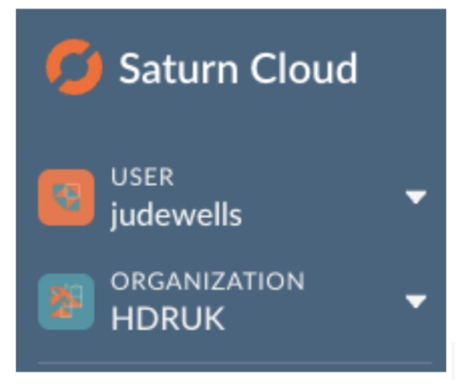
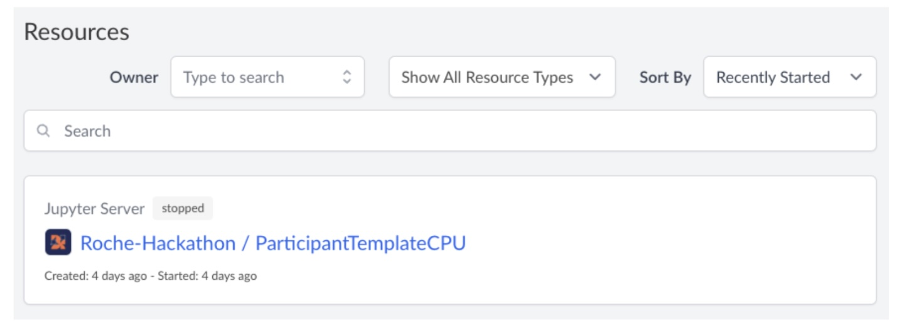
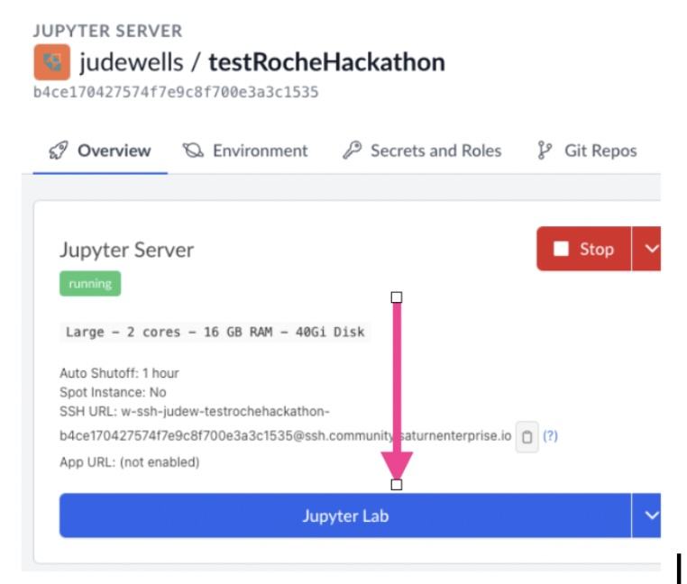

# Saturn Cloud Environment Setup

This page provides instruction on setting up your Saturn Cloud environment.

You should have received and accepted an invite from HDRUK to the Saturn Cloud. This will request that you create a Saturn Cloud account with an associated user name and password.

## Starting

1. Log in to [Saturn Cloud](https://saturncloud.io/) using the user name and password you created after accepting the invitation.

2. On the left side menu pane, make sure `Organization` is set to `HDRUK`

  

3. Under the resources section find: `Roche-Hackathon / ParticipantTemplateCPU`

  

4. After clicking on this resource open the `manage` tab and scroll down to the `Clone Resource` section and then click `clone as a Python server`

5. Click the `Start` button - it may take up to 5 minutes for the server to start up.

  

6. Once it says `running` click the blue Jupyter Lab button.

7. Open a terminal within the web browser

8. Check that your environment is working by running the following commands:

`cd RocheHackathon2024
python src/train.py`

9. You should see the baseline model training for 10 epochs and then evaluating (for two separate datasets). Results will be saved in `outputs/`

10. Next in the side-bar open the notebook that is in `RocheHackathon2024/notebooks`. This should give you some idea of the data format which you will use to train and evaluate your neural networks.
