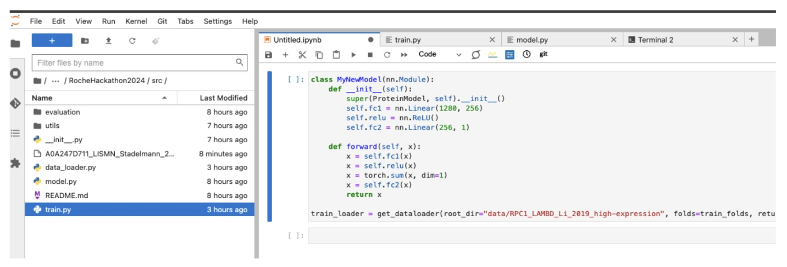
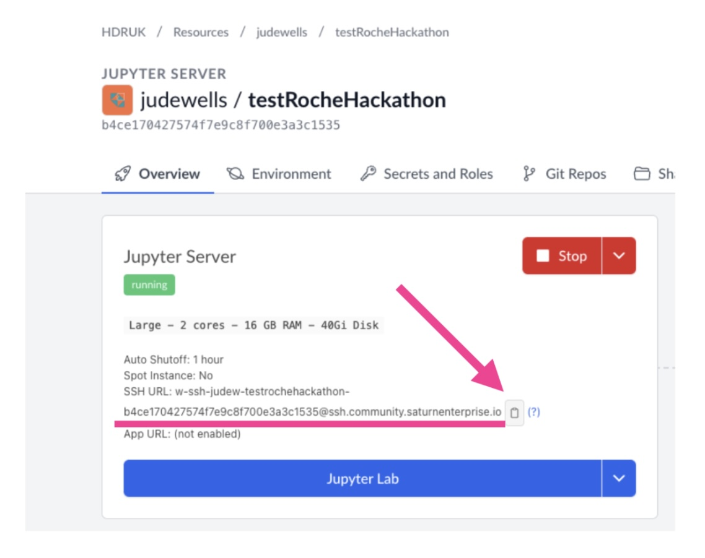

# Different ways of developing in Saturn Cloud 

## Connecting via browser

The easiest way is to work in your browser which provides a Jupyter Notebook interface, terminal and file browsers and editors.

  

## Connecting to Saturn Cloud via ssh

Follow [these instructions](https://saturncloud.io/docs/using-saturn-cloud/ide_ssh/) to connect to your Saturn Cloud environment via ssh on your machine.

If you already have an SSH key on the machine you want to connect with (for example your laptop) you can use your existing public ssh key to verify this machine for connecting to your Saturn Cloud instance. SSH keys are typically stored in ~/.ssh (where ~ is a shortcut to the user home directory).

If you need to create an SSH key you can follow [these instructions](https://docs.github.com/en/authentication/connecting-to-github-with-ssh/generating-a-new-ssh-key-and-adding-it-to-the-ssh-agent). Note that the email address used is just for organisational/labeling purposes and doesn't affect the functionality.

## Connecting via terminal 

Make sure you have first followed the ssh instructions above and created a key pair.

You can ssh in via a terminal/command line tool eg:

`​ssh  w-ssh-judew-testrochehackathon-b4ce170427574f7e9c8f700e3a3c1535@ssh.community.saturnenterprise.io`

Copy the SSH address using the clipboard button on Saturn Cloud:

  

## Connecting your IDE (PyCharm or VSCode) via SSH

Connecting your IDE to Saturn Cloud via SSH will allow you to edit and run code on the instance via your prefered software tool such as PyCharm or VS Code.

Make sure you have first followed the ssh instructions above and created a key pair.

Follow [these instructions](https://saturncloud.io/docs/using-saturn-cloud/ide_ssh/#connect-to-an-external-ide) to connect your code editor via ssh.

## Working outside of Saturn Cloud 

The source code for the project can be found here: [https://github.com/judeWells/RocheHackathon2024](https://github.com/judeWells/RocheHackathon2024)

You can download the sample data from this [Google Drive](https://drive.google.com/drive/folders/1QoT9-IfC4W5KzNpU-ONkLtyKxBDeNQnd?usp=sharing)